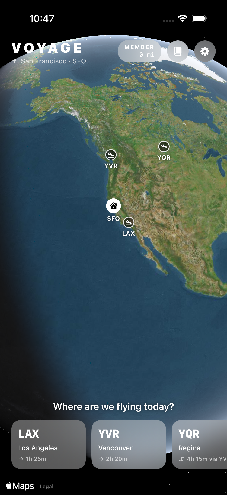
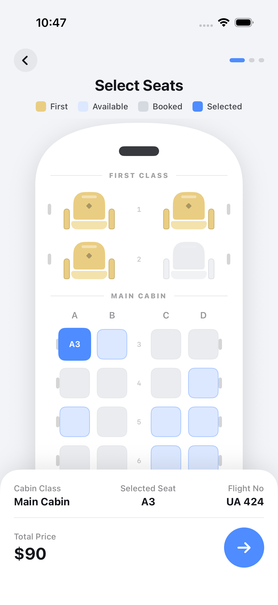
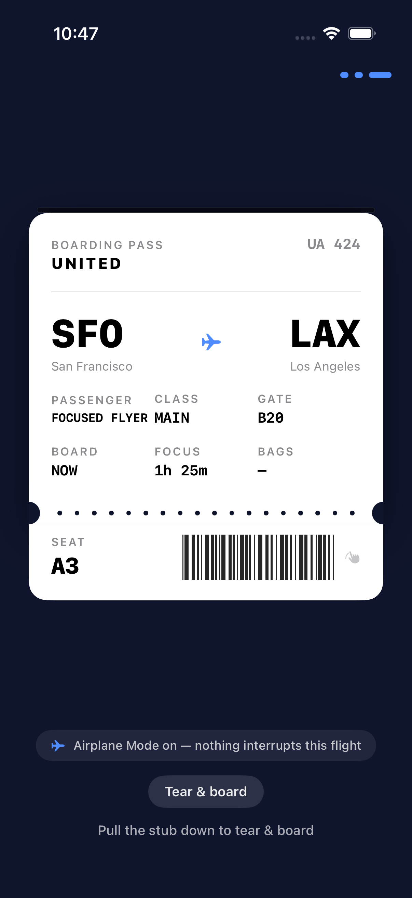
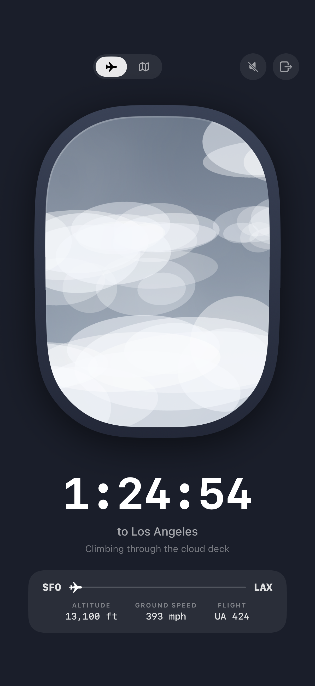

# Voyage iOS
The official Voyage iOS app — every study session is a flight.

License: [MIT License](LICENSE)
Source repo: https://github.com/machmoon/Voyage
Planning (bugs & features): [PLAN.md](PLAN.md) and [GitHub Issues](https://github.com/machmoon/Voyage/issues)

<p>
  
  
  
  
</p>

Book a real route on a 3D globe, pick a seat, tear your boarding pass, and focus through a live airplane-window view until you land. Leave mid-flight and the plane diverts.

## Building and Running

Note: Your Xcode version must be at least 15.0 (iOS 17 SDK).

```bash
git clone https://github.com/machmoon/Voyage.git
cd Voyage
open Voyage.xcodeproj
```

After opening the project, you should be able to run the app on the iOS Simulator (using the Voyage scheme and target). Select any iPhone simulator and press Cmd+R. There are no third-party dependencies and nothing else to install. If you encounter any issues, please don't hesitate to let us know via a bug report.

`Voyage.xcodeproj` is **generated** by [XcodeGen](https://github.com/yonaskolb/XcodeGen) from `project.yml`. Never hand-edit the pbxproj. After editing `project.yml`, or adding or removing source files outside Xcode, regenerate it:

```bash
xcodegen generate
```

To run on a physical iPhone, set your team under target → Signing & Capabilities (a free Apple ID works), then trust the developer certificate on the device under Settings → General → VPN & Device Management.

## Required Dependencies

If you'd rather know exactly what the project expects:

- **Xcode** — The easiest way to get Xcode is from the App Store, but you can also download it from developer.apple.com if you have an Apple ID registered with an Apple Developer account.
- **XcodeGen** (optional) — Only needed when you change `project.yml` or the file layout. Install with `brew install xcodegen`.
- **Metal toolchain** — `Voyage/Support/Shaders.metal` (the window's atmospheric-haze shader) requires it; if a fresh Xcode install can't compile `.metal` files, run `xcodebuild -downloadComponent MetalToolchain`.

## Contributing

Issues and pull requests are welcome. Read [PLAN.md](PLAN.md) first — it describes the MVP scope, the active workstreams, and their acceptance criteria. Anything outside that scope should start as an issue, not a PR.

## Development Guidelines

These are general guidelines rather than hard rules.

### Coding Guidelines

- Swift — [swift.org API Design Guidelines](https://www.swift.org/documentation/api-design-guidelines/)
- SwiftUI-only UI, no third-party dependencies, iOS 17+.
- Time is injected, never read directly: `FlightSession` takes a `VoyageClock`. Preserve this when adding any time-dependent behavior — it's what lets unit tests fly a whole route instantly with `ManualClock`.
- One palette: functional UI uses `Theme.accent`; per-city colors appear only on logbook stamps and the arrival moment. All sound is procedurally generated in `Voyage/Audio/` — no bundled audio assets.

### Formatting

We use Xcode's default 4 space indentation.

## Testing

The Voyage scheme is configured to execute the project's iOS unit and UI tests, which can be run using the Cmd+U hotkey or the Product → Test menu bar action, or from the command line:

```bash
# Everything
xcodebuild -project Voyage.xcodeproj -scheme Voyage \
  -destination 'platform=iOS Simulator,name=iPhone 17' test

# Unit tests only
xcodebuild ... test -only-testing:VoyageTests
```

In order for the UI tests to pass, the simulator's language and region should be en-US (the tests pass `-AppleLanguages (en)` themselves). Unit tests are offline by design: a `XCTestConfigurationFilePath` guard keeps `WeatherService` from touching the network, and audio settings are muted in `setUp`.

## Schemes and Targets

**Voyage** — The app. Debug builds behave identically to Release; there are no server environments, everything is on-device.

Useful launch arguments (Scheme → Run → Arguments, or `xcrun simctl launch booted com.patliu.voyage <arg>`):

- `-VoyageShortFlights` — compresses the takeoff roll to ~3s and climb to ~8s so the runway/cloud window scenes can be reviewed without waiting ~90 seconds of real time. The screenshot tour uses this.

**VoyageTests** — Unit tests: route catalog and planner, great-circle math, weather-code mapping, and `FlightSession` phase/diversion logic driven by `ManualClock`.

**VoyageUITests** — Two suites:

- `VoyageSmokeUITests` — launch → book → seat → bag → boarding pass.
- `ScreenshotTourUITests` — flies a full compressed flight and writes the `QA/*.png` screenshots committed in this repo. Rerun it after UI changes and review the diffs; it is the project's visual regression net.

## QA Screenshots

`QA/*.png` is committed on purpose: it's the current visual state of every major screen, regenerated by the screenshot tour. Logs (`QA/*.log`, `QA/*.txt`, `QA/uitest/`) are gitignored.

## Contact Us

If you have any questions or comments, open a [GitHub issue](https://github.com/machmoon/Voyage/issues). We'll also gladly accept any bug reports.
