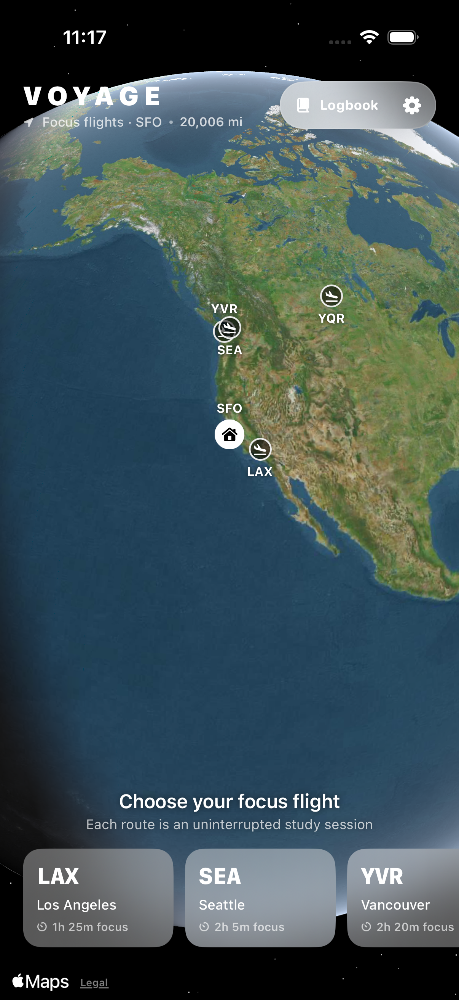
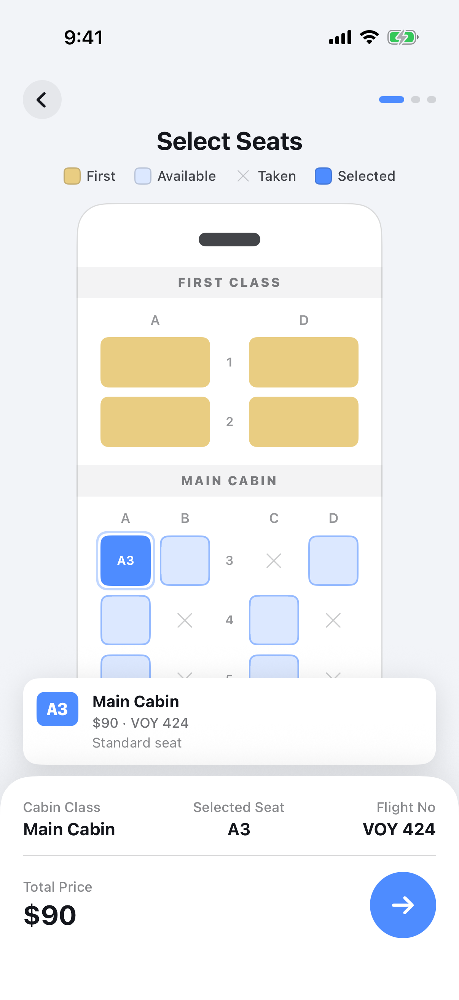
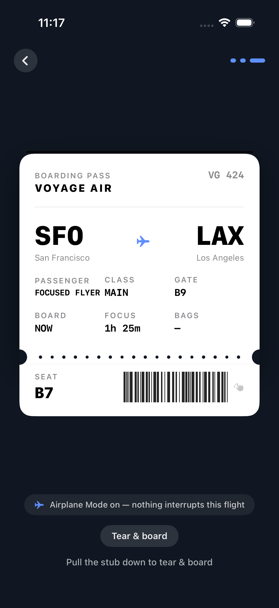
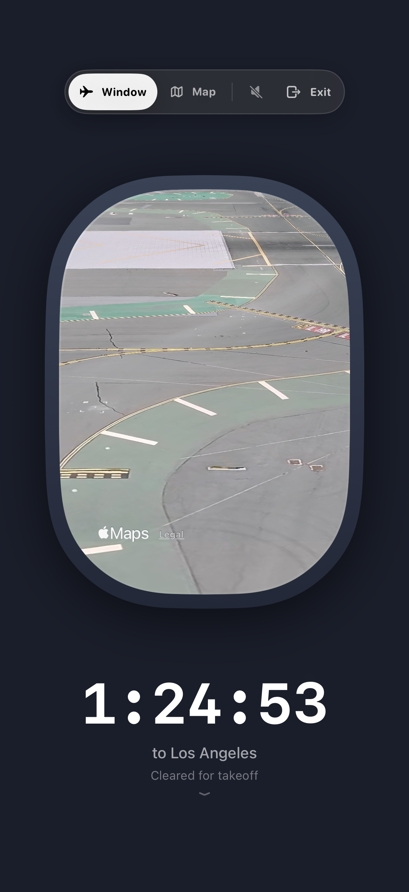

# Voyage

### A focus timer you have to land

Voyage turns a study session into a flight. Book a real route on a 3D globe, choose a seat, check your tasks as baggage, tear the boarding pass, and focus through a live airplane-window view until you arrive. Leave for more than 30 seconds and the aircraft diverts.

Built with **Codex powered by GPT-5.6** for the **Apps for Your Life** track of the [OpenAI Build Week Challenge](https://openai.devpost.com/).

[](#run-it)
[](#technical-implementation)
[-16A34A)](#technical-implementation)
[](LICENSE)

<p align="center">
  
  
  
  
</p>

## The problem

Starting a timer is easy. Obeying one is not.

Pomodoro timers measure an intention, but pressing **Start** creates almost no emotional obligation to finish. Air travel has the opposite property: a flight has a destination, a seat you chose, baggage you checked, and a very clear expectation that you should not leave halfway through.

Voyage borrows that psychological machinery. It is not an airplane placed next to a countdown. It is a personal commitment device in which beginning, remaining, and finishing all have consequences.

## The experience

1. **Book a real route.** Pick a destination from the globe. Directional block times, carriers, flight numbers, schedules, and popular connections come from the bundled route catalog.
2. **Choose your seat.** Aircraft and seat selection affect the passenger-camera geometry, window side, and wing view.
3. **Check your intentions.** Pack up to three tasks as baggage and claim the ones you complete after landing.
4. **Tear to depart.** The boarding pass is a physical commitment ritual, not a decorative confirmation screen.
5. **Focus through the flight.** Takeoff, climb, cruise, descent, and landing drive the window, map, weather, altitude, cabin lighting, announcements, haptics, and procedural audio.
6. **Do not abandon the aircraft.** Backgrounding starts a 30-second grace period. Missing the deadline diverts the flight.
7. **Land and remember it.** Completed flights earn miles, extend streaks, produce passport stamps, preserve completed intentions, and can be replayed from the logbook.

The active flight also appears in a Live Activity and the Dynamic Island, so the remaining time can be checked without reopening the app and accidentally causing an aviation incident.

## Why it belongs in Apps for Your Life

Voyage solves an ordinary personal problem—staying with work after deciding to begin—through an unusually complete behavioral metaphor.

| Challenge question | Voyage's answer |
| --- | --- |
| Is it useful in everyday life? | It turns studying, writing, reading, and other focus work into sessions with a meaningful commitment loop. |
| Is it a coherent product rather than a proof of concept? | Booking, boarding, flying, diversion, landing, rewards, replay, notifications, and lock-screen state form one end-to-end journey. |
| Is the idea meaningfully different? | Routes determine duration, seats determine the view, tasks become baggage, leaving causes diversion, and finishing creates a persistent travel history. The metaphor changes behavior instead of merely changing the theme. |
| Can judges run it? | Clone, open, and press Run. No accounts, keys, or sample-data downloads. The single package dependency resolves automatically, the route catalog is bundled, live data falls back cleanly, and `-VoyageShortFlights` compresses a flight for quick evaluation. |

## How Codex and GPT-5.6 were used

Voyage was built with **GPT-5.6 as the reasoning and coding model inside Codex**. Codex was not used only to scaffold the repository or autocomplete isolated functions. It remained inside the development loop from product definition through architecture, implementation, debugging, testing, and visual QA.

### Where Codex accelerated the workflow

| Workstream | How GPT-5.6 and Codex were used | Evidence in the repository |
| --- | --- | --- |
| Product design | Converted the initial “airplane timer” into a commitment ritual, challenged screens that did not reinforce the central loop, and repeatedly audited the app for decorative noise. | [`PLAN.md`](PLAN.md), [`QA/DESIGN_AUDIT.md`](QA/DESIGN_AUDIT.md), [`BoardingFlowView.swift`](Voyage/Views/Boarding/BoardingFlowView.swift) |
| State-machine architecture | Reasoned across timing, app lifecycle, audio, persistence, layovers, and failure states; helped centralize them in one deterministic session model instead of distributing clocks across views. | [`FlightSession.swift`](Voyage/Flight/FlightSession.swift), [`VoyageClock.swift`](Voyage/Support/VoyageClock.swift) |
| Unfamiliar platform work | Implemented and debugged SwiftUI, SwiftData, MapKit, ActivityKit, WidgetKit, Metal, AVFoundation, speech synthesis, App Intents, Core Location, and the Cloudflare Worker within one native product. | [`Voyage/`](Voyage/), [`VoyageWidgets/`](VoyageWidgets/), [`worker/`](worker/) |
| Flight simulation | Helped translate aircraft phase, seat side, weather, and elapsed time into a renderer-independent passenger-camera model that is deterministic enough for tests and replay. | [`DigitalTwin.swift`](Voyage/Models/DigitalTwin.swift), [`WindowWorldRenderer.swift`](Voyage/Views/Flight/WindowWorldRenderer.swift), [`Shaders.metal`](Voyage/Support/Shaders.metal) |
| Aviation data | Built and validated directional route data, great-circle interpolation, live weather normalization, and offline fallback behavior rather than relying on a permanently available demo backend. | [`RouteCatalog.swift`](Voyage/Models/RouteCatalog.swift), [`GreatCircle.swift`](Voyage/Models/GreatCircle.swift), [`worker/src/index.ts`](worker/src/index.ts) |
| Debugging | Traced failures across UI state, lifecycle transitions, generated Xcode configuration, shaders, sound, and test processes. Fixes were verified in code instead of being accepted from model output on faith. | Commit history, [`QA/FINAL_QA_REPORT.md`](QA/FINAL_QA_REPORT.md) |
| Automated verification | Generated unit and UI coverage for phase boundaries, diversion deadlines, connections, route geometry, weather mapping, digital-twin determinism, booking, and visual checkpoints. | [`VoyageTests/`](VoyageTests/), [`VoyageUITests/`](VoyageUITests/) |
| Visual iteration | Used simulator screenshots as model-visible evidence, compared complete flows, identified hierarchy and legibility problems, then regenerated the committed visual tour after changes. | [`QA/`](QA/), [`ScreenshotTourUITests.swift`](VoyageUITests/ScreenshotTourUITests.swift) |

### Key decisions made with Codex

#### 1. The ritual is the product

The first concept was an airplane-themed timer. GPT-5.6 helped interrogate which interactions actually changed commitment. That produced the seat → baggage → boarding-pass tear sequence and the decision to remove anything that did not strengthen departure or arrival.

#### 2. Time must be injected, never improvised

Several independent timers would eventually disagree about whether the flight was cruising, descending, or already parked at a gate in another application. Codex helped consolidate all temporal behavior into `FlightSession` and introduce `VoyageClock`. Production uses `SystemClock`; tests use `ManualClock` and can fly an entire route instantly.

#### 3. Flight phase should be derived, not stored

Within each leg, phase is a pure function of elapsed time:

$$
p=\min\left(1,\frac{t-t_0}{T}\right)
$$

The same session instant therefore drives the window, map, altitude, audio, announcements, Live Activity, screenshots, and replay. This eliminated an entire class of contradictory UI state.

#### 4. The experience must survive unavailable services

Codex helped design a layered weather and schedule strategy: live aviation data when available, platform or public fallbacks where appropriate, and bundled deterministic data as the final authority. A focus app should not become unfocusable because a weather provider is having a difficult afternoon.

#### 5. Visual polish must be testable

GPT-5.6 and Codex helped turn the simulator into a repeatable visual QA loop. `-VoyageShortFlights` compresses takeoff and climb, while UI tests navigate the real app and write screenshots into `QA/`. The project consequently has a visual regression tour rather than a collection of screenshots selected from the one occasion on which everything happened to work.

### What remained human

Codex increased the amount we could attempt; it did not choose what was worth shipping. We retained final control over the product thesis, interaction taste, aviation metaphor, scope, and acceptance of every change. Model-generated code was read, built, exercised in the simulator, and covered with tests where failure would affect the journey.

This human/model division mattered. GPT-5.6 supplied unusually broad technical reasoning across the stack. Human judgment kept that breadth pointed at one idea: **a study session you cannot quietly abandon, dressed as a flight you chose to take.**

## Technical implementation

Voyage is a native iOS 17 application built almost entirely on first-party Apple frameworks. It has **one third-party dependency, and it is optional**: the [Google Maps 3D SDK](https://github.com/googlemaps/ios-maps-3d-sdk) (pinned to `0.2.1`) supplies photorealistic streamed scenery for the passenger window. Without an API key the app degrades automatically to MapKit, and then to the procedural Metal renderer. Every other layer — persistence, audio, navigation, widgets, intents — is Apple-native.

| Layer | Technology | Responsibility |
| --- | --- | --- |
| Interface | SwiftUI | Globe, booking, boarding ritual, in-flight cabin, arrival, passport, and settings |
| Session engine | Observation + injected clock | Timing, phases, lifecycle enforcement, layovers, diversion, cues, and completion |
| Persistence | SwiftData | Flights, miles, streaks, intentions, weather snapshots, and replay metadata |
| Navigation | MapKit + great-circle SLERP | Route drawing, aircraft position, follow camera, terrain, and satellite modes |
| Window world | SwiftUI Canvas + Metal | Runway, clouds, haze, weather, passenger camera, aircraft performance, and wing view |
| Streamed scenery | Google Maps 3D → MapKit → procedural | Optional photorealistic terrain, selected at runtime by key availability and thermal state |
| Audio | AVFoundation + AVSpeechSynthesizer | Procedural ambience, chimes, PA filtering, stamps, and phase transitions |
| System integration | ActivityKit, WidgetKit, App Intents, notifications | Dynamic Island, lock screen, Siri/Shortcuts, departure reminders, and focus integration |
| Live data | Cloudflare Worker + aviation weather | Normalized METAR weather and optional licensed schedule adapter |
| Verification | XCTest + XCUITest | 107 unit tests and 8 UI tours, including automated visual and demo capture |

### Deterministic flight engine

`FlightSession` is the center of the app. It owns two layered state machines:

```text
preflight ──→ inFlight ──→ layover ──→ arrived
                  │             │
                  └→ diverted   └→ missedConnection
```

Each leg derives `takeoffRoll → climb → cruise → descent → landing` from elapsed time. Renderers never start private wall clocks, so live flight, test flight, screenshot capture, and logbook replay agree about the same instant.

### Great-circle navigation

Given unit vectors $a$ and $b$ for the origin and destination, the aircraft position at progress $p$ is calculated with spherical interpolation:

$$
\operatorname{slerp}(a,b,p)=
\frac{\sin((1-p)\theta)}{\sin\theta}a+
\frac{\sin(p\theta)}{\sin\theta}b,
\qquad
\theta=\cos^{-1}(a\cdot b)
$$

This follows the curvature of the Earth rather than the geographically innovative straight lines preferred by ordinary screen coordinates.

### Real data without demo fragility

- The route catalog contains every supported directed airport pair, including directional block times and popular connections.
- Weather uses live aviation observations and stores a frozen departure snapshot for deterministic replay.
- The Worker normalizes external responses and performs at most one upstream request per cache miss.
- Unit tests remain offline.
- If all live services are unavailable, Voyage continues with its bundled catalog and clear weather rather than crashing at the gate.

## Run it

### Requirements

- macOS with Xcode 15 or newer
- iOS 17 SDK
- An iPhone simulator or physical iPhone
- XcodeGen only if regenerating the project after file-layout changes
- Metal toolchain for `Shaders.metal`

**No accounts, API keys, or sample-data downloads are required.** Xcode resolves the one Swift Package dependency (Google Maps 3D SDK) automatically on first open; if you are offline, see [Running without the package](#running-without-the-package) below.

### Fastest judge path

```bash
git clone https://github.com/machmoon/Voyage.git
cd Voyage
open Voyage.xcodeproj
```

In Xcode:

1. Select the **Voyage** scheme.
2. Select any iPhone simulator running iOS 17 or newer.
3. Press **Cmd+R**.
4. Choose a destination, select a seat, check a bag, and tear the pass.

For a compressed demonstration, add `-VoyageShortFlights` under **Scheme → Run → Arguments**, or launch an already installed simulator build with:

```bash
xcrun simctl launch booted com.patliu.voyage -VoyageShortFlights
```

This compresses the takeoff roll to approximately 3 seconds and reaches cruise at approximately 8 seconds. Route duration, persistence, and strict-mode logic remain unchanged.

### Sample data

None to download. Everything needed to fly is compiled into the app:

- [`RouteCatalog.swift`](Voyage/Models/RouteCatalog.swift) — every supported directed airport pair, with directional block times, carriers, flight numbers, schedules, and popular connections.
- [`Airport.swift`](Voyage/Models/Airport.swift) — airport coordinates, names, and metadata used by the globe and great-circle math.
- Weather falls back to clear conditions when live observations are unavailable, so a first run never blocks on the network.

The logbook starts empty by design — the first flight you complete is the first stamp in the passport.

### Optional: photorealistic scenery

The passenger window picks its renderer at runtime in this order:

1. **Google Maps 3D** — photorealistic streamed terrain. Requires an API key.
2. **MapKit** — Apple's satellite and terrain layer. No key needed.
3. **Procedural Metal** — the fully offline authored sky, clouds, and runway.

Tiers 2 and 3 are always available, so **the app is complete and demo-ready with no configuration**. To enable tier 1:

```bash
cp Config.example.xcconfig Config.local.xcconfig
```

Add your key to `Config.local.xcconfig`:

```
GOOGLE_MAPS_API_KEY = your_key_here
```

`Config.local.xcconfig` is git-ignored and is `#include?`-ed by the checked-in base config, so a clean checkout without it still builds. Restrict the key to the `com.patliu.voyage` bundle identifier and to the Maps 3D SDK in the Google Cloud Console — keys embedded in an iOS app are not secrets, so the application and API restrictions are the real security boundary.

### Running without the package

Xcode resolves the Google Maps 3D package on first open, which requires network access once. After that first resolve the package is cached and the project builds offline. The SDK is a compile-time dependency of [`RealWorldTwinView.swift`](Voyage/Views/Flight/RealWorldTwinView.swift), so it must be present to build — but it is inert at runtime without a key, and the window falls back to MapKit and procedural scenery.

### Build from the command line

Check for a booted simulator first:

```bash
xcrun simctl list devices booted
```

Then substitute its device name:

```bash
xcodebuild -project Voyage.xcodeproj -scheme Voyage \
  -destination 'platform=iOS Simulator,name=iPhone 17' build
```

If a fresh Xcode installation cannot compile the Metal shader:

```bash
xcodebuild -downloadComponent MetalToolchain
```

### Run the tests

```bash
# Unit and UI tests
xcodebuild -project Voyage.xcodeproj -scheme Voyage \
  -destination 'platform=iOS Simulator,name=iPhone 17' test

# Unit tests only
xcodebuild -project Voyage.xcodeproj -scheme Voyage \
  -destination 'platform=iOS Simulator,name=iPhone 17' \
  test -only-testing:VoyageTests
```

Unit tests cover session phases, diversion deadlines, layovers, persistence, great-circle geometry, route planning, weather mapping, flyer tiers, and deterministic digital-twin frames. UI tests cover booking, boarding, the in-flight tour, and authored SFO window checkpoints.

## Project structure

```text
Voyage/
├── App/                 Application entry point and root routing
├── AppIntents/          Siri and Shortcuts integration
├── Audio/               Procedural cabin audio, PA, and haptics
├── Flight/              Deterministic FlightSession state machine
├── Models/              Airports, routes, logbook, geometry, digital twin
├── Support/             Clock, weather, scheduling, notifications, shader
└── Views/               Booking, boarding, flight, landing, sharing, logbook
VoyageWidgets/           Live Activity and Dynamic Island extension
VoyageTests/             Unit tests
VoyageUITests/           Smoke, screenshot, demo, and visual-checkpoint tours
worker/                  Cloudflare aviation-data adapter
QA/                      Committed visual state and design audit
```

## Project generation

`Voyage.xcodeproj` is generated from [`project.yml`](project.yml). After adding or removing source files, regenerate it instead of editing the project file manually:

```bash
brew install xcodegen
xcodegen generate
```

## Privacy and resilience

- Voyage requires no account.
- The logbook is stored locally with SwiftData.
- Location is used to select the nearest home airport.
- The app contains no advertising or analytics SDKs.
- The iOS client contains no provider secrets. The optional Google Maps key is a bundle-restricted client identifier, not a credential, and is supplied through a git-ignored local config.
- The schedule provider is optional; failure falls back to the bundled catalog.
- Unit tests never contact weather services.

## Build Week submission

- **Track:** Apps for Your Life
- **Built with:** Codex + GPT-5.6
- **Source:** This repository
- **License:** [MIT](LICENSE)
- **Project story:** [`DEVPOST.md`](DEVPOST.md)
- **Three-minute demo script:** [`BUILD_WEEK_DEMO.md`](BUILD_WEEK_DEMO.md)
- **Visual QA:** [`QA/`](QA/)

The required `/feedback` Codex Session ID is supplied in the Devpost submission form.

## License

Voyage is available under the [MIT License](LICENSE).
